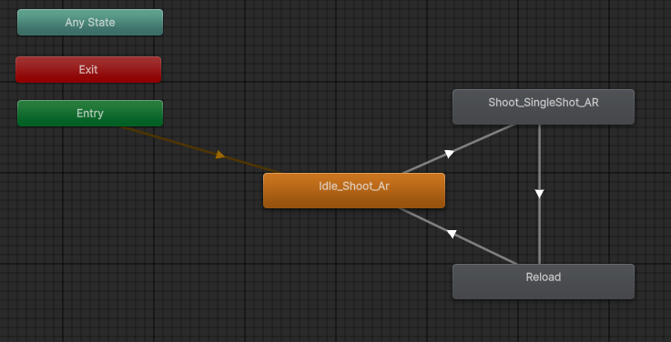
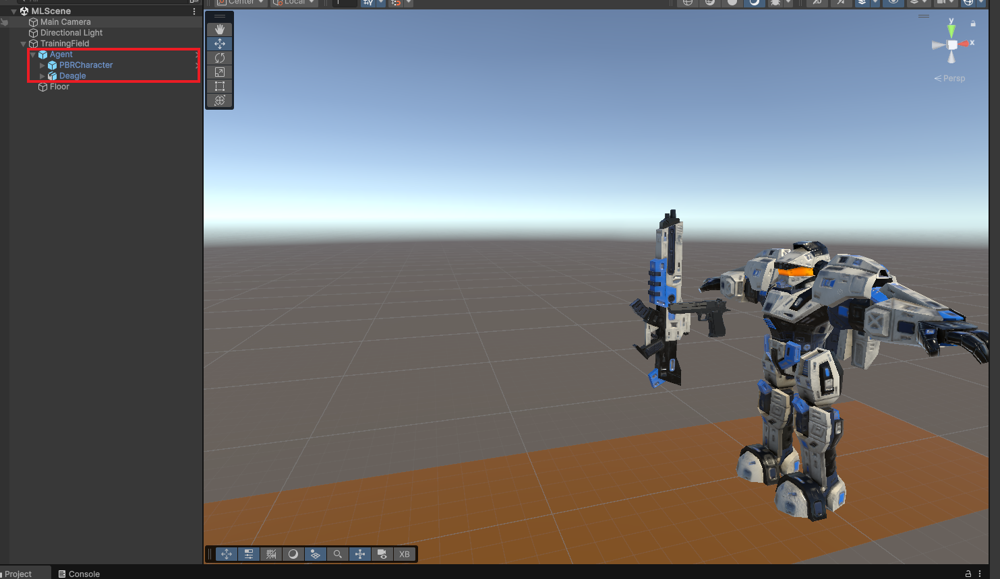
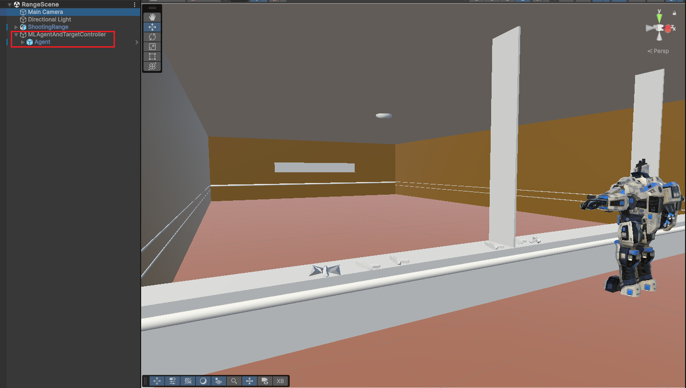
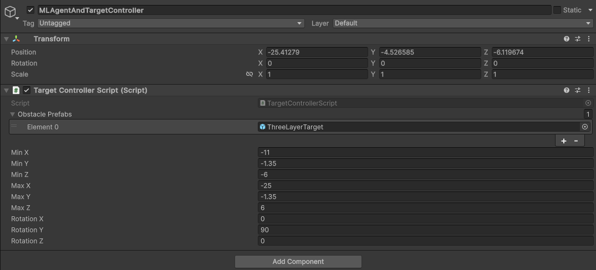
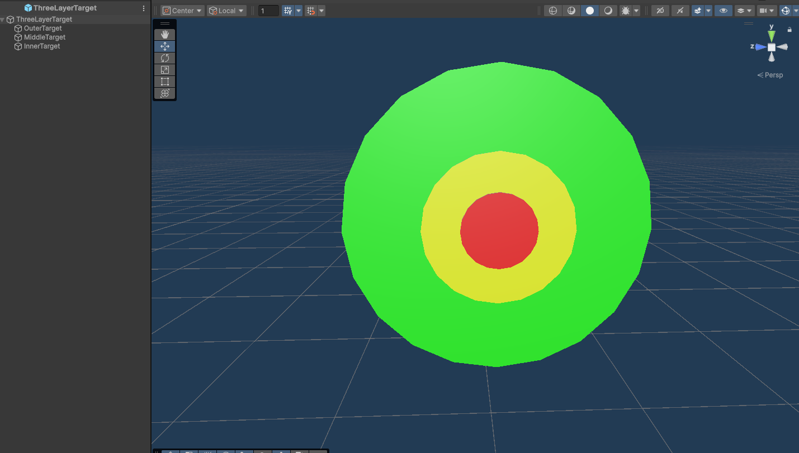
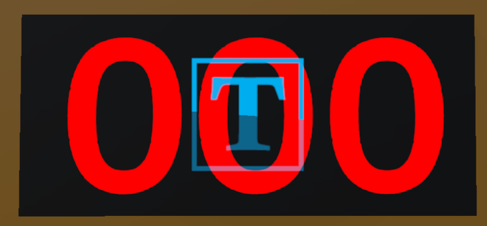
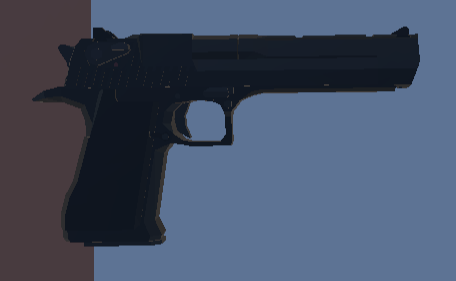
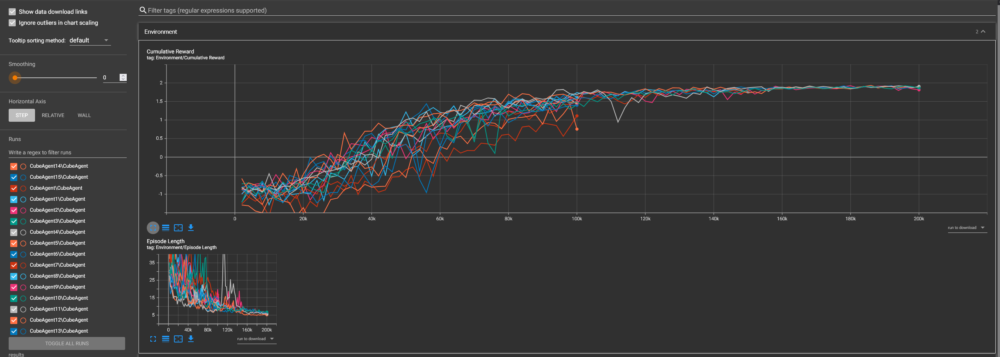
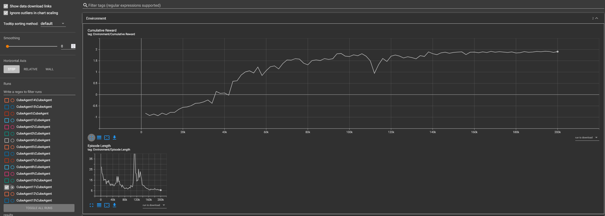

# Shooting Range in Unity - VR user interactie en Machine Learning object detectie

Project en documentatie door:

- Jarno Dierckx
- Brent Van Daele
- Robin Breugelmans

## Inleiding

In deze tutorial behandelen we hoe VR en machine learning kunnen toegepast worden binnen Unity om een goede gebruikservaring van onze game te verkrijgen. Machinelearning en raycasting is een belangrijke techniek voor moderne games. Hiermee kunnen er zeer uitdagende games ontwikkeld worden die gamers aanspreken. We leggen uit hoe we deze raycasting, machine learning en VR kunnen implementeren in je eigen projecten.

## Samenvatting

Na het doorlopen van deze tutorial weet je hoe je raycasting, machine learning en VR kan configureren en toepassen in je eigen projecten, met behulp van de cursus "VR Experience". Je bent in staat om dit tutorial project zelfstandig opnieuw op te bouwen en eventueel uitbreiden. Je krijgt inzicht over hoe raycasting kan gebruikt worden binnen een ml-agent, hoe een ml-agent geïntegreerd kan worden in een VR applicatie en hoe je een interactieve VR-game kunt ontwikkelen.

## Methoden

### Versies

- Unity: 6000.0.36f1 LTS
- ML-Agents Unity plugin: 3.0.0
- ML-agents Python: 0.30.0
- Python: 3.9.21
- TensorBoard: 2.8.0
- TensorFlow: 2.8.0
- OpenXR Plugin: 1.14.0
- XR Hands: 1.5.0
- XR Interaction Toolkit: 3.0.7
- XR Plugin Management: 4.5.0

### Verloop

Bij de opstart van het spel moet de speler het spel handmatig starten. Vervolgens krijgt de speler een beperkte tijd om zo veel mogelijk doelwitten te raken in de shooting range. De goal van het spel is voor de speler om een hogere score te behalen dan de ML-agent.

Er wordt altijd één doelwit gegenereerd dat voor beiden de ML-agent en speler dient. Als de speler het doelwit mist, krijgt hij/zij geen straf, maar zal de ML-agent kan alsnog wel dit doelwit raken en zo de score stelen. wanneer de speler het doelwit wel raakt, ontvangt hij/zij een score afhankelijk van de kleur van het geraakte deel van het doelwit.

Eens het doelwit geraakt is door de ML-agent of speler, verdwijnt het en wordt er automatisch een nieuw doelwit geplaatst. Het spel loopt door tot de bepaalde tijd verstreken is.

### ML-agent beloningen, acties en observaties

Voor de ML-agent is het belangrijk de juiste keuzes te maken. Zo worden ze opgesplitst in typisch een 3 tal keuzes.

#### Observaties

Één van deze belangrijke keuzes is beslissen wat de agent allemaal kan zien en wat hij allemaal moet leren. Zo zijn we er bij dit project voor gegaan dat de agent het target zijn locatie weet staan om de training sneller en makkelijker te laten verlopen. Ook zullen we de agent zijn eigen rotatie als ook de "rechtdoor" richting van het geweer meegeven zodat hij altijd weet waar deze zich bevind. In onze prefab van het geweer dat gebruikt is, is de voorkant van het geweer echter:

``` C#
  sensor.AddObservation((-aiGun.transform.right).normalized);
```

Dit komt door de keuzes van de originele developer van deze asset.

#### Acties en beloningen

De agent zijn acties bestaan uit slechts 2 componenten, een continuous actie voor het roteren en een continuous actie voor het schieten. In onze "OnActionReceived" kunnen we dan volgende bewerkingen doen:

```C#
public override void OnActionReceived(ActionBuffers actions)
{
    if (!timerController.TimerRunning)
    {
        // AI should do nothing if timer isn't running
        return;
    }
    float horizontal = actions.ContinuousActions[0];
    float shoot = actions.ContinuousActions[1];
    //Debug.Log($"shoot: {shoot}, horizontal: {horizontal}");

    transform.Rotate(Vector3.up * horizontal * rotationSpeed * Time.deltaTime);
    SetReward(-0.001f);

    if (shoot >= 0.5f && currentShotCount < maxShots)
    {
        Debug.Log("Shooting");
        currentShotCount++;
        SetReward(0.001f);
        Debug.DrawRay(aiGun.transform.position, -aiGun.transform.right*fovDistance, Color.red);
        animator.SetTrigger("Shoot");
        if (Physics.Raycast(aiGun.transform.position, -aiGun.transform.right, out RaycastHit hit, fovDistance) && hit.transform.gameObject.layer == 6)
        {
            Debug.Log("Hit");
            SetReward(2.0f);
            score.AddScoreML(hit.transform.gameObject.GetComponent<TargetScript>().Hit());
            EndEpisode();
        }
    }
    else if (shoot < 0.5f && currentShotCount < maxShots)
    {
        SetReward(-0.01f);
    }
    else
    {
        SetReward(-1.0f);
        EndEpisode();
    }
}
```
Eerst wordt gekeken of er een timer is aan het lopen. Als dit niet het geval is gebeurt er niets.
Dan worden de acties gelezen om deze verder te gebruiken in het programma. Zo zal de "horizontal"-actie al onmiddellijk gebruikt worden voor het roteren van de agent. Bij elke rotatie krijgt de agent een minimale straf van 0.001 om het willekeurig en veel roteren te ontmoedigen. Vervolgens wordt de "shoot"-actie onder handen genomen. Als de "shoot"-variabele groter is dan 0.5 zullen we dit als echt schieten zien. Echter mag de agent maar een beperkt aantal keer schieten voor de episode eindigt. Zolang dit maximum niet bereikt is zullen we de "shoot"-variable van hoger dan 0.5 ook echt laten schieten. Het aantal schoten word verhoogt en een debug lijn wordt getekend (dit maakt het gemakkelijker om de agent in het oog te houden). We zullen ook de animatie van onze animatiecontroller een trigger voor het schieten sturen, later hier meer over. Het schieten krijgt een zere kleine beloning voor het voorkomen dat de agent niet meer wilt schieten. Tenslotte zullen we controleren of een schot van het geweer wel degelijk het target raakt. Indien het geraakt word zullen we een grote beloning geven, het target vernietigen, de score optellen bij het globaal en de episode eindigen.

Echter als de waarde van "shoot" kleiner is dan 0.5 zal dit als vals schot gezien worden. Tenslotte is er ook een clause voor de laatste optie, namelijk als currentShotCount groter is dan maxShots, dan zal de episode eindigen en als mislukt worden beschouwd met een straf van -1.0.

#### Beloningen extra

In de toekomst kan deze implementatie ook nog verbeterd worden door de beloningen nog beter te beheren. Zo kunnen we bijvoorbeeld de beloning wanneer "shoot" kleiner is dan 0.5 veranderen aangezien deze omdat deze mogelijk niet in lijn ligt met het bedoelde gedrag.

### Objecten en hun gedrag

#### ML-agent

Zoals hiervoor besproken heeft de ML-Agent de kennis van de target nodig om goed te functioneren. Daarom zullen we een extra functie toevoegen aan het agentScript zodat we een nieuwe target kunnen toewijzen via een extern script.

```C#
  public void SetNewTarget(GameObject target)
  {
    this.target = target;
  }
```

Vervolgens gaan we ook de agent zijn standaard rotatie laten herinneren en resetten wanneer de episode eindigt.

```C#
void Start()
{
  // Get the Animator from a child GameObject
  animator = GetComponentInChildren<Animator>();
  Transform deagle = transform.Find("Deagle"); // get gun to make invisible
  if (deagle != null)
  {
    Renderer deagleRenderer = deagle.GetComponent<Renderer>();
    if (deagleRenderer != null)
    {
      deagleRenderer.enabled = false;  // Makes Deagle invisible
    }
  }
}

public override void OnEpisodeBegin()
{
  this.transform.localRotation = Quaternion.Euler(0, -90, 0);
  this.currentShotCount = 0;
}
```

Dit zorgt voor een snellere en vlottere training, maar als je nog een meer zelf lerende ai wil maken moet je dit niet doen, net zoals de target locatie.

In de start functie hebben we er ook voor gezorgd dat de gun prefab dat we gebruiken voor de player en de logica onzichtbaar maken maar wel actief houden. We hebben er namelijk voor gekozen om een asset te gebruiken om de agent een leuke skin te geven. Echter om bij de gratis assets te blijven vonden we de "Robot Hero : PBR HP Polyart" het beste passen. Deze heeft een eigen geweer prefab waar al animaties voor beschikbaar zijn, vandaar onze keuze. De logica is nog altijd gebaseerd op de deagle prefab.

Nu we bij het bespreken van deze asset gekomen zijn, kunnen we hier dieper op in gaan. De asset zijn standaard animatie controller, die zich bevind in de volgende folder "Assets/SciFiWarriorPBRHPolyart/Animators", is niet zoals het moet voor onze situatie dus zullen we deze aanpassen zodat enkel de volgende 3 animaties overblijven:



Door aan de overgang van de idle naar de shoot animatie een trigger van "Shoot" te bevestigen hebben we deze mooi geïmplementeerd in de ML agent. Nu kunnen we het agent script aan het agent object (empty game object) hangen en de deagle prefab alsook de PBRCharacter prefab (van de Robot Hero : PBR HP Polyart asset) als children bevestigen aan de agent. Deze agent kan dan vervolgens in een prefab gemaakt worden om deze zo gemakkelijk terug te plaatsen in onze game waar nodig. *De materialen van de assets moeten mogelijk geconverteerd worden naar de Universal Render Pipeline*.



Voor de rest van de agent settings baseren we ons op het gegeven principe van het vak "VR Experiences". Dit is met als uitzondering de yaml file, deze zullen we op volgende manier opstellen. We hebben ondervonden dat dit het beste resultaat leverde op ons apparaat en in onze implementatie.

```yaml
behaviors:
  CubeAgent:
    trainer_type: ppo
    hyperparameters:
      batch_size: 128
      buffer_size: 1024
      learning_rate: 3.0e-4
      beta: 5.0e-4
      epsilon: 0.2
      lambd: 0.99
      num_epoch: 5
      learning_rate_schedule: linear
      beta_schedule: constant
      epsilon_schedule: linear
    network_settings:
      normalize: false
      hidden_units: 128
      num_layers: 2
    reward_signals:
      extrinsic:
        gamma: 0.99
        strength: 1.0
    max_steps: 200000
    time_horizon: 64
    summary_freq: 2000
```

#### Target-Controller

De target controller, dat het parent object is van onze agent, is in onze game een empty game object dat het TargetController script krijgt toegewezen. In de trainings scene is dit het trainings veld zoals te zien is in de vorige paragraaf. Echter zal dit in onze game implementatie een empty game object zijn dat dit script krijgt, met als child de agent prefab.



**Het is hier zeer belangrijk, om met het plaatsen van de agent, de agent zijn rotatie NIET aan te passen.** De agent is namelijk getraind in deze specifieke rotatie en kan dus falen wanneer geroteerd. De beste optie is om de omgeving aan te passen aan de agent zijn rotatie.

Vervolgens gaan we het target controller script coder op volgende manier:

```C#
using UnityEngine;
using UnityEngine.Rendering;

namespace Assets.Scripts
{
    public class TargetControllerScript : MonoBehaviour
    {
        [SerializeField] GameObject[] obstaclePrefabs; // the targets to look for

        [SerializeField] float minX = -6;
        [SerializeField] float minY = -2;
        [SerializeField] float minZ = -5;
        [SerializeField] float maxX = 6;
        [SerializeField] float maxY = 1;
        [SerializeField] float maxZ = -25;
        [SerializeField] float rotationX = 0;
        [SerializeField] float rotationY = 90;
        [SerializeField] float rotationZ = 0;
        private float x = 0;
        private float y = 0;
        private float z = 0;

        GameObject currentTarget;

        // Start is called once before the first execution of Update after the MonoBehaviour is created
        void Start()
        {
            x = Random.Range(minX, maxX);
            y = Random.Range(minY, maxY);
            z = Random.Range(minZ, maxZ);
            currentTarget = Instantiate(
                obstaclePrefabs[Random.Range(0, obstaclePrefabs.Length)], 
                position: new Vector3(x, y, z), 
                Quaternion.Euler(rotationX, rotationY, rotationZ)
                );
            this.GetComponentInChildren<AgentScript>().SetNewTarget(currentTarget);
        }

        // Update is called once per frame
        void Update()
        {
            if (currentTarget == null)
            {
                x = Random.Range(minX, maxX);
                y = Random.Range(minY, maxY);
                z = Random.Range(minZ, maxZ);
                currentTarget = Instantiate(
                    obstaclePrefabs[Random.Range(0, obstaclePrefabs.Length)],
                    position: new Vector3(x, y, z),
                    Quaternion.Euler(rotationX, rotationY, rotationZ)
                    );
                this.GetComponentInChildren<AgentScript>().SetNewTarget(currentTarget);
            }
        }
    }
}
```

Deze controller is eigenlijk een zeer simpele logica voor onze targets op een willekeurige plaats the genereren binnen een bepaalde zone. Daarom zijn er een aantal "SerializeField" variabelen dat ons toelaten om deze zone in te stellen alsook de rotatie van het target (sinds we de agent niet kunnen roteren moeten we zorgen dat alles juist geroteerd staat). Dan zal de start functie het eerste target genereren en een random positie geven in onze gekozen zone. Echter is het mogelijk om meerdere targets te maken en genereren, zolang ze op **Layer 6** ingesteld staan (meer hierover bij Target). Eens een random gekozen target gegeneerd is zal deze ook toegewezen worden aan de ML-agent, wat ook meteen de verklaring is waarom het TargetController object (het empty game object dat dit script bevat) de parent is van de ML-agent prefab. Daarnaast is er nog een Update functie die elke frame zal checken for het huidige target destroyed is. Indien het destroyed is zal deze opnieuw het target genereren op dezelfde wijze als in de start functie.

Tenslotte kunnen we de target controller ook configureren door het script toe te voegen en in te stellen. Hier kunnen we dan de SerializeField variabelen invullen zoals het past voor onze applicatie.



De transform waarden van de zijn niet van groot belang zolang de ML-agent juist geplaatst is in de unity omgeving, **Behalve de rotatie! De rotatie van de agent moet onveranderd blijven t.o.v. de wereld oriëntatie!**

#### Target

De target zelf is een vrij simpel design en kan ook veranderd worden in andere vormen naar wensen. Echter moet er dan wel een aanpassing gebeuren aan het script van het target, later hier meer over.

Ons target bestaat uit meerdere delen om zo een beter verdeelde score te geven in verband met de accuraatheid van het schieten. Zo hebben we 3 individuele schijven die 1, 3 of 5 als score geven. Elk van deze schijven is een child van het main target object (dat een empty game object is). Dit target wordt een prefab en zal enkel als prefab meegegeven worden aan de TargetController zijn script!



De logica van het target is vrij simpel. Eens het target, of beter één van de schijven van dit target, geraakt wordt zal het hoofd target object (dus het parent object van de schijf dat geraakt is) vernietigt worden en een score terug gegeven worden. En dat is alles in het target script. Uiteraard zal de waarde voor de score per schijf meegegeven kunnen worden voor elk script van elke schijf.

```C#
using UnityEngine;
using UnityEngine.UIElements;

namespace Assets.Scripts
{
    public class TargetScript : MonoBehaviour
    {
        [SerializeField] short points = 1;

        public short Hit()
{
    if (!PauseManager.Instance.IsPaused)
    {
        Destroy(this.transform.parent.gameObject); // destroy the parent of the individual target circles
        return points;
    }
    else
    {
        return 0;
    }
    
}
    }
}
```

Indien er gewenst wordt een ander target te gebruiken is dit mogelijk, maar moet de "Destroy" codelijn aangepast worden zodat deze altijd verwijst naar het volledige target object. Als het spel gepauzeerd is kan het target ook niet worden geraakt.

#### ScoreBoard

De scoreborden laten de score van de speler en de ML agent zien, ze staan achteraan de shooting range.



Het scorebord laat altijd 3 cijfers zien.

```cs
public class ScoreBoard : MonoBehaviour
{
    [SerializeField]
    TextMeshPro tmp;
    int score = 0;

    public void AddScore(int score)
    {
        this.score += score;
        updateText();
    }

    public void ResetScore()
    {
        this.score = 0;
        updateText();
    }

    void updateText()
    {
        tmp.text = $"<mspace=.6em>{score.ToString("D3")}</mspace>";
    }
}
```

#### Score Script

Dit script houdt de scores van de ML agent en de speler bij en update de scoreborden.

```cs
public class ScoreScript : MonoBehaviour
{
    int scoreML = 0;
    int scorePlayer = 0;

    [SerializeField]
    ScoreBoard scoreBoardML;
    [SerializeField]
    ScoreBoard scoreBoardPlayer;

    public void AddScorePlayer(int scoreToAdd)
    {
        scorePlayer += scoreToAdd;
        scoreBoardPlayer.AddScore(scoreToAdd);
    }

    public void AddScoreML(int scoreToAdd)
    {
        scoreML += scoreToAdd;
        scoreBoardML.AddScore(scoreToAdd);
    }

    public void ResetScores()
    {
        scoreML = 0;
        scorePlayer = 0;
        scoreBoardML.ResetScore();
        scoreBoardPlayer.ResetScore();
    }
}
```
#### TimerController script
Dit script beheert de timer op de clock dat zich in het begin van het spel links van de speler begeeft.
```cs
public class TimerController : MonoBehaviour
{
    public float timerDuration = 60f;
    private float timer;
    public bool TimerRunning { get; private set; } = false;

    private TextMeshPro text; // Text component reference
    [SerializeField] private ScoreScript scoreScript;

    void Start()
    {
        text = GetComponent<TextMeshPro>();
        timer = timerDuration;
        UpdateText();
    }

    public void StartTimer()
    {
        timer = timerDuration;
        TimerRunning = true;

        if (scoreScript != null)
        {
            scoreScript.ResetScores();
        }
        /*else
        {
            Debug.LogWarning("ScoreScript not assigned in TimerController.");
        }*/
    }

    void Update()
    {
        if (TimerRunning)
        {
            timer -= Time.deltaTime;
            if (timer <= 0)
            {
                timer = 0;
                TimerRunning = false;
            }
            UpdateText();
        }
    }

    void UpdateText()
    {
        if (text != null)
        {
            text.text = timer.ToString("F1"); // Show one decimal place
        }
    }
}
```
StartTimer() zet de timer gelijk aan timerDuration, wat normaal 60 seconden is. Het reset ook de scores op beide scoreborden.
Update() zorgt dat de timer aftelt en UpdateText() zorgt ervoor dat de text op de clock de nieuwe resterende tijd weergeeft.

#### TimerResetButton script

```cs
[SerializeField] TimerController timerController;

public void ResetTimer()
{
    timerController.StartTimer();
}
```
Heeft als enige functie ResetTimer(), wat de StartTimer() functie van TimerController.cs oproept.

#### PauseManager script

```cs
public class PauseManager : MonoBehaviour
{
    public static PauseManager Instance { get; private set; }

    public bool IsPaused { get; private set; } = false;

    [SerializeField] private GameObject pauseSign; // Assign in Inspector

    private void Awake()
    {
        if (Instance != null && Instance != this)
        {
            Destroy(gameObject);
        }
        else
        {
            Instance = this;
        }
    }

    public void TogglePause()
    {
        IsPaused = !IsPaused;
        UpdatePauseState();
    }

    public void SetPause(bool value)
    {
        IsPaused = value;
        UpdatePauseState();
    }

    private void UpdatePauseState()
    {
        if (pauseSign != null)
        {
            pauseSign.SetActive(IsPaused);
        }
    }
}
```
Dit script word door enkele andere scripts gebruikt om te kijken of het spel gepauzeerd is of niet. Het zet ook het pauze bord in het spel actief of inactief als de juiste functie word aangeroepen.

#### PauseInputHandler script
```cs
public class PauseInputHandler : MonoBehaviour
{
    private XRControls controls;

    void Awake()
    {
        controls = new XRControls();
    }

    void OnEnable()
    {
        controls.Game.Pause.performed += OnPausePressed;
        controls.Game.Enable();
    }

    void OnDisable()
    {
        controls.Game.Pause.performed -= OnPausePressed;
        controls.Game.Disable();
    }

    private void OnPausePressed(InputAction.CallbackContext context)
    {
        PauseManager.Instance.TogglePause();
    }
}
```

Dit zorgt ervoor dat als de secondaire knop op de rechtse controller wordt ingedrukt, het spel pauzeerd.
In XR Device Controller Controls(Input Actions Editor) is er een Action Map "Game" toegevoegd met daarin een Action "Pause". Dit zorgt ervoor dat de juiste knop op de controller aan de pauzeer functie is gekoppeld

#### Shooting range

#### Gun



Dit script is het script van het geweer van de speler, hier staat de code voor het vast te nemen en te schieten.
In de shoot methode wordt er via raycasting bepaald waar het de kogel beland, als het op een object met layer 6 komt dan is het een target en dan wordt er score toegevoegd en de target verwijdert (via target.Hit()).
De OnGrab en OnExit methodes worden aangeropen als je het geweer vastneemt of laat vallen.

```cs
public class Gun : MonoBehaviour
{
    [SerializeField] ScoreScript score;

    public InputActionReference activateL;
    public InputActionReference activateR;
    public NearFarInteractor interactor = null;
    private bool selected = false;

    [SerializeField]
    private Material bulletHoleMaterial;
    [SerializeField]
    private AudioSource shotSound;

    private Transform fire;

    void Start()
    {
        interactor.selectEntered.AddListener(OnGrab);
        interactor.selectExited.AddListener(OnExit);

        activateL.action.performed += Use;
        activateR.action.performed += Use;

        fire = transform.GetChild(1).transform;
    }

    private void Use(CallbackContext callback)
    {
        if (!selected)
            return;

        shoot();
    }

    private void shoot()
    {
        shotSound.Play();
        if (Physics.Raycast(fire.position, transform.forward, out RaycastHit hit, 2048f)) //, maxDistance
        {
            //layer 6 = Target layer
            if (hit.transform.gameObject.layer == 6)
            {
                score.AddScorePlayer(hit.transform.gameObject.GetComponent<TargetScript>().Hit());
            }
            else
            {
                GameObject bulletHole = GameObject.CreatePrimitive(PrimitiveType.Quad);
                Destroy(bulletHole.GetComponent<Collider>());
                bulletHole.transform.rotation = Quaternion.FromToRotation(Vector3.back, hit.normal);
                bulletHole.transform.localScale = new Vector3(.11f, .11f, 1f);
                bulletHole.GetComponent<Renderer>().material = bulletHoleMaterial;
                bulletHole.transform.position = hit.point + hit.normal * .001f;
                Destroy(bulletHole, 90); //90s
            }
        }
    }

    private void OnExit(SelectExitEventArgs arg0)
    {
        selected = false;
    }

    private void OnGrab(SelectEnterEventArgs arg0)
    {
        if (arg0.interactableObject.transform.gameObject == gameObject)
        {
            selected = true;

        }
    }
}
```

### One-pager
1 V AI Shooting Range
Dierckx Jarno, Breugelmans Robin en Van Daele Brent

Het spel is een competitie tegen een AI-tegenstander waar de speler en de AI-agent een zo hoog mogelijke score moeten behalen. De speler kan punten verdienen door in de range op het doelwit te schieten, en krijgt zo meer of minder punten afhankelijk van waar het doelwit werd geraakt.
De shooting range zelf is dan ook de enige scene in het spel, en bestaat uit een gebouw met daarin een geweer voor de speler, de AI en het doelwit.
De simulatie start zodra de timer wordt gestart. Beide de speler en de AI moeten dan tegelijkertijd op een target schieten. Het doelwit veranderd na iedere hit van positie en de score wordt in real-time weergegeven op een scorebord achteraan de ruimte. Als de tijdslimiet verloopt worden de scores vergeleken en wordt de winnaar aangeduid. De speler heeft nadien de optie om opnieuw te spelen.

Waarom AI?
De AI-tegenstander introduceert een competitief element dat de speler motiveert om beter te mikken en sneller te reageren. In tegenstelling tot een eenvoudige scoreteller zonder tegenstander, zorgt de AI voor een levendige en dynamische uitdaging. Voor deze toepassing gebruiken we een Single-Agent Reinforcement Learning AI, waarbij de agent getraind is om te mikken en te schieten op een manier die menselijke prestaties nabootst en overstijgt.

Waarom VR?
Een VR simulatie maakt het leuker om met een geweer te schieten. En ondanks dat er enkele schietbanen in België zijn, maken de meeste mensen er geen gewoonte van om één te bezoeken.
Dit spel kan zo een ervaring nabootsen vanuit het comfort dat de speler thuis zelf heeft. Door de 3D-diepte en de mogelijkheid om met echte bewegingen te richten, wordt het spel fysiek interactiever en natuurlijker dan via traditionele schermen.

Interactiemodel tussen speler en systeem
De speler kan vrij rondkijken en bewegen binnen de ruimte van de shooting range. Interactie gebeurt voornamelijk via de handcontrollers: het oppakken en richten van het wapen en het vuren. Scores worden automatisch toegekend op basis van waar het doelwit geraakt wordt. Daarnaast is er visuele feedback via een scorebord en timer. De AI-agent voert zelfstandig acties uit op basis van zijn "beslissingen", zodat het aanvoelt als een echte tegenstander. Deze interactie creëert een meeslepende simulatie die zowel leuk als leerzaam is.

### Afwijkingen van one-pager

## Resultaten

### Training

Om de ML-agent goed getraind te krijgen moeten we natuurlijk meerdere belonging structuren en hyper parameters proberen. Zo hebben we er dus een heel groot aantal verschillende geprobeerd. Onderstaande afbeelding toont slechts een deel van onze trainingspogingen, maar bevat de beste resultaten.



Echter gaan we er uiteraard maar slechts één kiezen voor onze ML-agent. Om opzoek te gaan naar de best training hebben we besloten om volgende gedachten gang te ondersteunen:

- zo lang mogelijk blijven leren
- zo weinig variatie as mogelijk
- zo hoog mogelijk op het einde

Daarom zijn we uiteindelijk op volgende resultaat gekomen.



Deze voldeed aan al onze eisen. Hij bleef stijgen voor zo lang mogelijk, had zeer weinig variatie naar het einde toe en was op het einde de grafiek met de hoogste reward.

### Waarnemingen

In de grafiek van ons gekozen resultaat, namelijk de grafiek van CubeAgent11, zijn een aantal dingen op te merken in verband met het leren van de agent.


Zo valt het op dat de grafiek in het negatieve begint. Dit betekent dat onze agent een heel groot aantal fouten maakte dat door onze beloningsstructuur bestraft wordt. Zo zal hij bijvoorbeeld overmatig geroteerd hebben.  Het volgende dat opvalt is dat variatie in het begin best wel groot is, te zien aan de donker grijze lijn dat op de grafiek staat tussen de x-as waarden van 20k en 140k. Dit betekent dat de agent nog best veel gokt en random acties uitvoert. Echter wordt deze variatie veel kleiner en stabieler na 140k stappen waar de agent zo goed als altijd de juiste handelingen doet. En zelfs daar blijft de agent zijn reward nog zachtjes stijgen wat betekent dat de agent bijna tot op het einde goed geleerd heeft. Tenslotte is er ook nog de opvallende dip rond 115k stappen. Deze dip betekent dat de agent durft af te wijken van eerder geleerd gedrag om alternatieven te verkennen om tot het beste resultaat te komen, zo zal hij niet vast blijven zitten op een valse "top" score. We kunnen in de kleine grafiek onderaan ook zien dat die dip overeen komt met een zeer lange episode lengte wat betekent dat de agent, door zijn gewaagde poging, het doelwit uiteindelijk niet raakte. De agent heeft zichzelf daarna opnieuw gecorrigeerd.

De training vertoonde een positief leerproces met stabiele vooruitgang. Echter kan een ML-agent altijd verbeterd worden door een nog beter reward structuur en een betere set hyperparameters. Je kan ook de agent langer laten trainen met een iets lagere learning rate kiezen om hem stabieler te laten leren, maar dan moet je wel een pc/laptop hebben die het vereiste aantal stappen aankan (de laptop waar de ML-agent nu op getraind is kon maar tot 200k stappen).

## Conclusie

In dit project ontwikkelden we een VR-shooting game in Unity waarin een machine learning-agent via raycasting leert concurreren met een menselijke speler.

De resultaten van de agent waren positief en stabiel naar het einde toe. Zo bleef de agent voortdurend leren en consistente keuzes maken. Echter was onze agent alert en onderzocht alternatieve strategieën.

Wat we persoonlijk uit de resultaten halen is dat de agent zeer goed aan het groeien is een veel potentieel heeft om nog te verbeteren mits andere configuraties. Echter moeten we wel een oog houden op zijn zijn afwijkende leerpogingen.

We kunnen in de toekomst nog veel verbeteringen aanbrengen aan onze game. Zo kunnen we beter assets zoeken en gebruiken die beter bij elkaar passen. We kunnen eventueel een verhaallijn toevoegen of de game uitdagender maken met meer en andere targets. We kunnen de ML-agent ook verticaal laten navigeren en zo drie dimensionaal een uitdaging creëren. Tenslotte kunnen we ook de ml-agent meerdere keren toevoegen om zo een multi shooter spel te maken.

## Bronnen

### Notities

> Sommige bronnen zijn geraadpleegd voor begrip en ontwikkeling tijdens het project, ook al is de inhoud ervan niet zichtbaar in het eindresultaat. Alle bronnen zijn opgenomen voor transparantie en volledigheid.

> APA citaties in dit document zijn gegenereerd en gevormd met behulp van CHATGPT (OpenAI, 2025). De bronnen zijn door ons gekozen.

> Dit document is ook opgesteld met behulp van CHATGPT (OpenAI, 2025) als begeleidende factor voor formulering van zinnen en tekst alsook spellingscorrectie.

> Sommige stukken code en inzichten zijn gebaseerd op oefeningen en richtlijnen uit de cursussen "VR Experience" en "3D Game Programming" van Tom Peeters, gegeven aan AP Hogeschool in 2025 en 2023 respectievelijk.

### Bronvermelding

- GeeksforGeeks. (2020, October 15). C# break statement. <https://www.geeksforgeeks.org/c-sharp-break-statement/>
- Microsoft Copilot. (n.d.). copilot.microsoft.com. <https://copilot.microsoft.com> (Geraadpleegd op 12 mei 2025; geen code overgenomen in eindversie)
- OpenAI. (2025). ChatGPT (June 5 version) [gpt-4-1-mini]. Gebruikt voor generatie van APA 7 citaties. <https://chat.openai.com/>
- Stack Overflow. (2015, February 15). Raycast to get GameObject being hit to run script and function on GameObject [Answer]. Stack Overflow. <https://stackoverflow.com/questions/30020429/raycast-to-get-gameobject-being-hit-to-run-script-and-function-on-gameobject>
- Unity. (2025, June 4). Debug.DrawLine. <https://docs.unity3d.com/ScriptReference/Debug.DrawLine.html>
- Unity. (2025, June 4). Debug.DrawLine (v5.3.0). <https://docs.unity3d.com/530/Documentation/ScriptReference/Debug.DrawLine.html>
- Unity. (2025, June 4). GameObject.tag. Unity. <https://docs.unity3d.com/6000.0/Documentation/ScriptReference/GameObject-tag.html>
- Unity. (2025, June 4). Unity.MLAgents.Sensors.RayPerceptionOutput. <https://docs.unity3d.com/Packages/com.unity.ml-agents@1.0/api/Unity.MLAgents.Sensors.RayPerceptionOutput.html>
- Unity. (2025, June 4). Vector3.Angle. <https://docs.unity3d.com/ScriptReference/Vector3.Angle.html>
- Unity Masters Hub. (2023). Implementing raycasting in Unity 3D: A step-by-step guide. <https://unitymastershub.com/implementing-raycasting-in-unity-3d-a-step-by-step-guide-2/>
- Unity Technologies. (2015, March 5). Making a Raycast visible [Online forum post]. Unity Forums. <https://discussions.unity.com/t/making-a-raycast-visible/135103>
- Unity Technologies. (2019, January 10). What does really mean the forward direction? [Online forum post]. Unity Forums. <https://discussions.unity.com/t/what-does-really-mean-the-forward-direction/842678>
- Unity Technologies. (2019, February 15). Why when using Vector3.Dot the dot value is never more than 1? [Online forum post]. Unity Forums. <https://discussions.unity.com/t/why-when-using-vector3-dot-the-dot-value-is-never-more-then-1/854406>
- Unity Technologies. (2019, July 19). How do I reset the rotation? [Online forum post]. Unity Forums. <https://discussions.unity.com/t/how-do-i-reset-the-rotation/236760>
- Unity Technologies. (2020, November 13). How to check if Raycast hits a certain object [Online forum post]. Unity Forums. <https://discussions.unity.com/t/how-to-check-if-raycast-hits-a-certain-object/248279>
- Unity Technologies. (2021, September 2). How to check Ray Perception Sensor 3D [Online forum post]. Unity Forums. <https://discussions.unity.com/t/how-to-check-ray-perception-sensor-3d/914089/2>
- Unity Technologies. (2022, May 25). Raycasting for interactables [Online forum post]. Unity Forums. <https://discussions.unity.com/t/raycasting-for-interactables/920097>
- Unity Technologies. (2022, July 25). How to search a list for GameObjects with tag and copy them into a new list? [Online forum post]. Unity Forums. <https://discussions.unity.com/t/how-to-search-a-list-for-gameobjects-with-tag-and-copy-them-into-a-new-list/665075/6>
- Unity Technologies. (2023, April 13). Angle between two 3D points on a plane [Online forum post]. Unity Forums. <https://discussions.unity.com/t/angle-between-two-3d-points-on-a-plane/252685>
- Van Daele, B. (2023). CubeAgent.cs [Source code]. GitHub. <https://github.com/AP-IT-GH/jumper-assignment-BrentVanDaele/blob/main/Jumper/Assets/Scripts/CubeAgent.cs>
- Wikipedia contributors. (2025, March 5). Field of view. Wikipedia. Retrieved June 5, 2025, from <https://en.wikipedia.org/wiki/Field_of_view>
- Peeters, T. (2025). VR Experience [Cursusmateriaal, AP Hogeschool]. Persoonlijke lessen en oefenopdrachten gebruikt als referentie en basis voor implementatie.
- Peeters, T. (2023). 3D Game Programming [Cursusmateriaal, AP Hogeschool]. Gebruikt voor codevoorbeelden, technische inzichten en referentie tijdens projectontwikkeling.
- Philipp. (2017, May 18). Target range [3D model]. Sketchfab. <https://sketchfab.com/3d-models/target-range-45c07cbdfa3e49d594fdc2dd6c2940ea>. Het origin 3d-model voor de scene.
